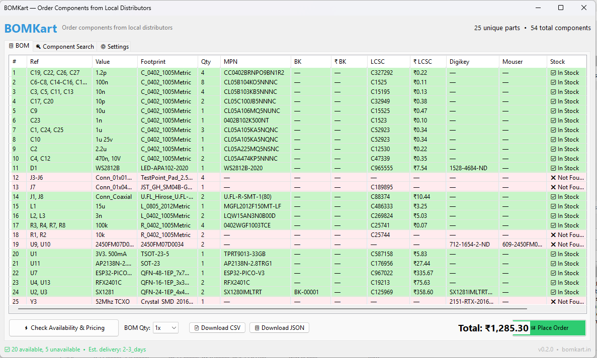

# BOMKart — KiCad Plugin

**Order electronics components from local Indian distributors, directly from KiCad.**

No more switching tabs, copy-pasting part numbers, or waiting weeks for international shipments. BOMKart reads your PCB's BOM, checks real-time availability from distributors in Delhi-NCR, shows you pricing from both local stock and LCSC, and lets you place an order — all without leaving KiCad.



---

## Features

- **One-click BOM extraction** — reads MPN, value, footprint, quantity directly from your PCB
- **BK catalog** — every part gets a BOMKart part number (BK-XXXXX) for fast repeat lookups
- **LCSC integration** — auto-fetches LCSC PN, pricing, datasheet, and image for every part
- **Dual pricing** — shows ₹ BK (local distributor) and ₹ LCSC side by side, highlights the cheaper one in green
- **Quantity multiplier** — 1x / 2x / 5x / 10x / 25x / 50x / 100x BOM for production runs
- **CSV export** — download full BOM with pricing for sourcing or procurement
- **Component search** — search any MPN or value without leaving KiCad
- **Uber-style ordering** — broadcast to matching distributors, first to confirm gets the order

---

## Installation

### Option 1 — Manual (recommended for now)

1. Download the latest release zip from [Releases](https://github.com/iottrends/bomkart-plugin/releases)
2. Extract and copy the `BOMKart` folder to your KiCad plugins directory:

   | OS | Path |
   |---|---|
   | Windows | `C:\Users\<you>\AppData\Roaming\kicad\10.0\scripting\plugins\` |
   | Linux | `~/.local/share/kicad/10.0/scripting/plugins/` |
   | macOS | `~/Library/Preferences/kicad/10.0/scripting/plugins/` |

3. Restart KiCad
4. Open PCB Editor → **Tools → External Plugins → BOMKart**

### Option 2 — KiCad Plugin Manager (coming soon)

BOMKart will be submitted to the official KiCad Plugin & Content Manager (PCM).

---

## Setup

1. Open the plugin → **⚙ Settings** tab
2. API Server URL is pre-filled: `https://api.bomkart.lambdauav.com/v1`
3. Fill in your **Name**, **Phone (WhatsApp)**, and **Delivery Pincode**
4. Click **Test Connection** to verify
5. Go to **📋 BOM** tab → click **⚡ Check Availability & Pricing**

---

## How it works

```
Your KiCad PCB
      ↓
BOMKart reads BOM (MPN, value, footprint, qty)
      ↓
Backend looks up BK catalog (MPN → BK number + LCSC PN)
      ↓
Fetches pricing: local distributor stock + LCSC API
      ↓
Shows dual pricing table — highlights cheapest in green
      ↓
Place Order → broadcast to matching distributors
      ↓
Distributor confirms → delivery next day in Delhi-NCR
```

---

## Schematic Fields Supported

Add these fields to your KiCad symbols for best results:

| Field | Example | Description |
|---|---|---|
| `MPN` | `CL05B104KB54PNC` | Manufacturer part number |
| `LCSC` | `C14663` | LCSC part number |
| `BK` | `BK-00002` | BOMKart catalog number |
| `Mouser` | `187-CL05B104KB54PNC` | Mouser part number |
| `DigiKey` | `1276-1234-1-ND` | DigiKey part number |

Only MPN is required. If you have LCSC PN, LCSC pricing loads instantly without any search.

---

## Project Structure

```
BOMKart/
├── __init__.py              # KiCad plugin entry point
├── bomkart_action.py        # Plugin action class
├── bom_extractor.py         # Reads PCB, groups BOM items
├── value_normalizer.py      # 100nF = 0.1uF = 100n
├── api_client.py            # HTTP client for BOMKart backend
├── config/
│   └── settings.py          # Persistent settings (~/.config/bomkart/)
├── dialog/
│   └── main_dialog.py       # Main wxPython UI
└── resources/
    └── bomkart_icon.png     # Plugin icon
```

---

## Backend

The plugin talks to the BOMKart backend API. The backend is private and hosted at `https://api.bomkart.lambdauav.com`.

If you want to run your own backend (self-host), the API is compatible — just point the plugin to your server URL in Settings.

---

## Requirements

- KiCad 8.x or 10.x
- Python 3.9+ (bundled with KiCad)
- Internet connection (for LCSC pricing and BK catalog lookup)

---

## License

MIT — free to use, modify, and distribute.

---

## Contact

- Email: abhinav.iottrends@gmail.com
- Issues: [GitHub Issues](https://github.com/iottrends/bomkart-plugin/issues)
